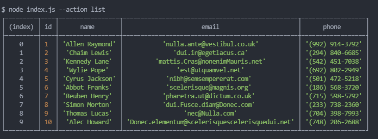
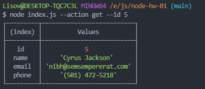
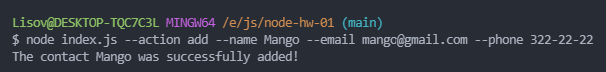
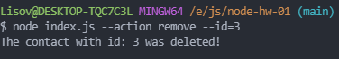

# goit-nodejs-hw-01-cli-app

Description:

- CLI Application to Handle Contacts.

Tools:

- Node.js
- commander

## Examples:

### Получаем и выводим весь список контактов в виде таблицы (console.table)

node app.js --action list

### Получаем контакт по id

node app.js --action get --id 5

### Добавялем контакт

node app.js --action add --name Mango --email mango@gmail.com --phone 322-22-22

### Удаляем контакт

node app.js --action remove --id=3

### Обновляем контакт

node app.js --action update --id 5 --name Mango --email mango@gmail.com --phone 322-22-22

